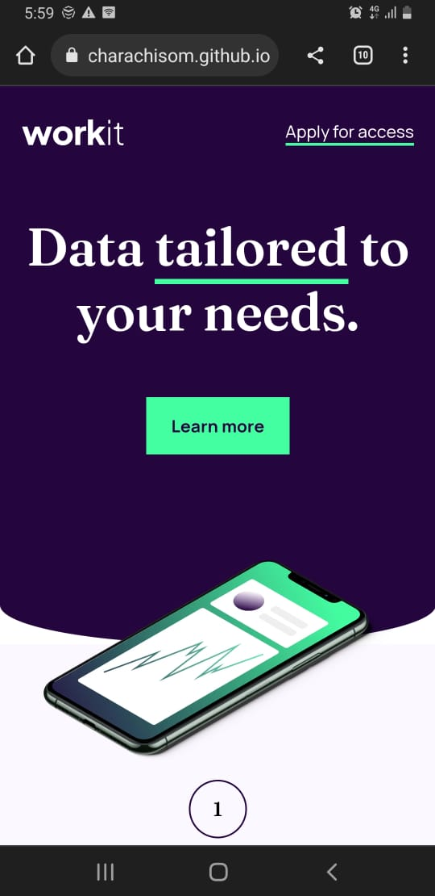

# Frontend Mentor - Workit landing page

### Links

- Solution URL: [Add solution URL here](https://github.com/AcharaChisom/FEMentor_workit)
- Live Site URL: [Add live site URL here](https://acharachisom.github.io/FEMentor_workit/starter-code/index.html)

### Screenshot

## My process

### Built with

- Semantic HTML5 markup
- CSS custom properties
- Flexbox
- Mobile-first workflow

### What I learned

- working with the position and background-image css properties . . . still loads to learn
- applied the BEM naming model
- fundamentals of the box model and their unique and quirky properties.

### Continued development

- weak in working with images in general . . . will have to go deeper into that.

### Useful resources

- [Scrimba](https://scrimba.com/learn/frontend) - This helped introduce me to the fundamentals of html/css

## Author

- Website - [Achara Chisom Solomon](https://acharachisom.github.io/my-portfolio/)
- Frontend Mentor - [@AcharaChisom](https://www.frontendmentor.io/profile/AcharaChisom)
- Twitter - [@Chisom14Solomon](https://twitter.com/Chisom14Solomon)
